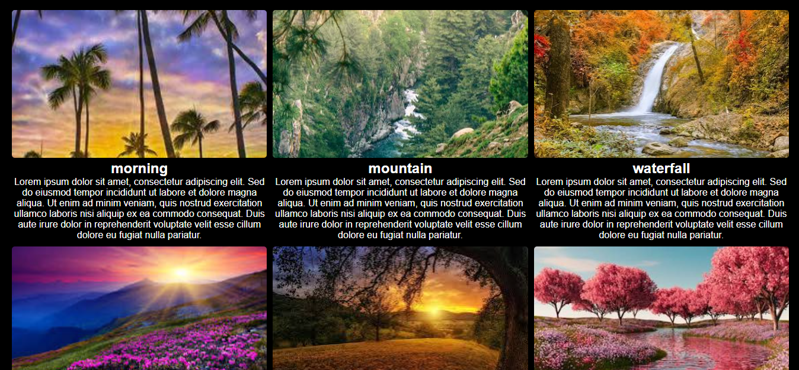

# 🖼️ React Image Gallery

A simple and responsive image gallery built with **React.js**. The gallery displays images with their titles and descriptions in a clean grid layout.

## ✨ Features

* 🖼️ Displays multiple images
* 📱 Responsive grid layout
* 📝 Image titles and descriptions
* ⚛️ Built with React.js
* 🎨 Styled with CSS

## 🛠️ Technologies Used

* React.js
* JavaScript
* CSS
* HTML
* Vercel

## 🌐 Live Demo

[View Live Demo](https://dynamic-image-gallery-one.vercel.app/)

## 📸 Preview

<p align="center">
  
</p>

## 🚀 How to Run

```bash
npm install
npm start
```
